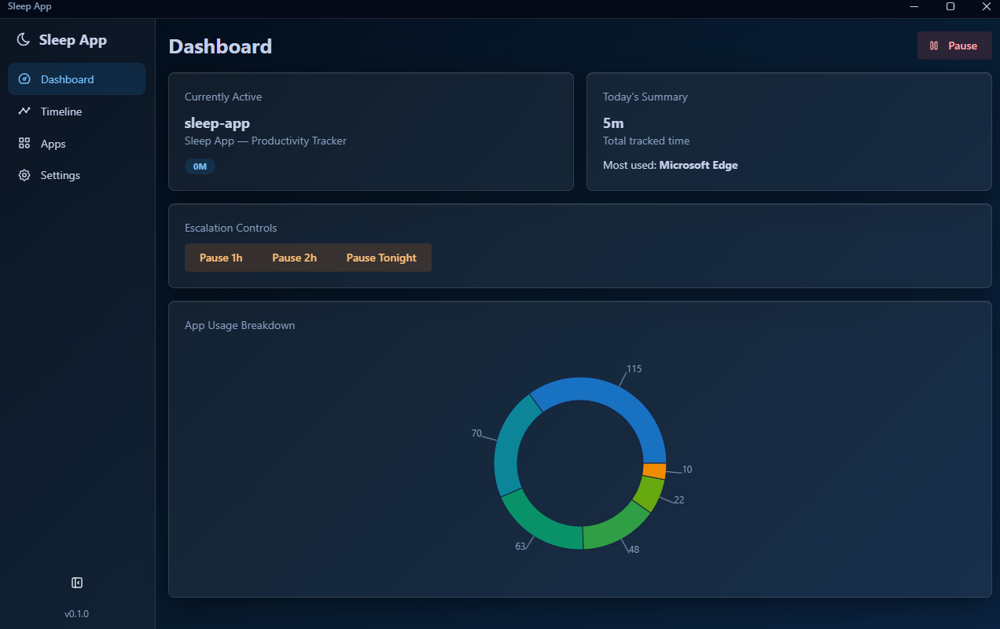
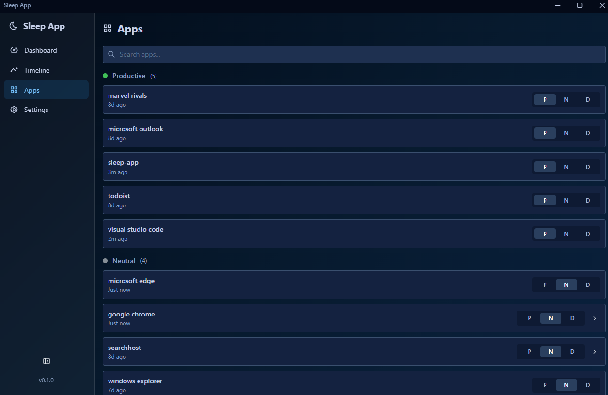
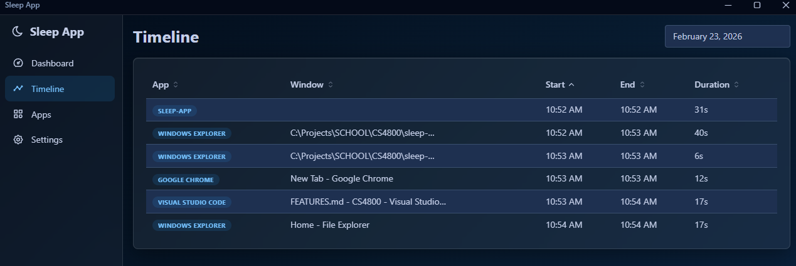
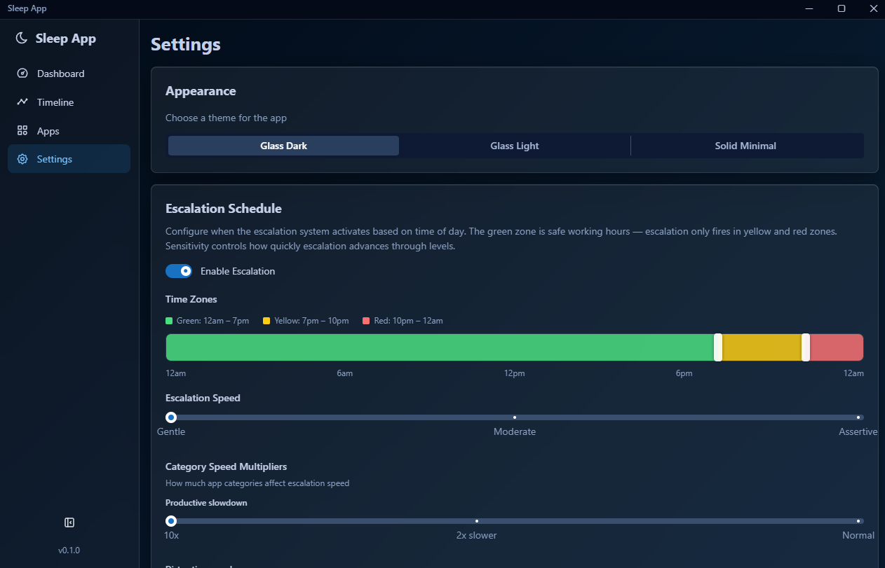
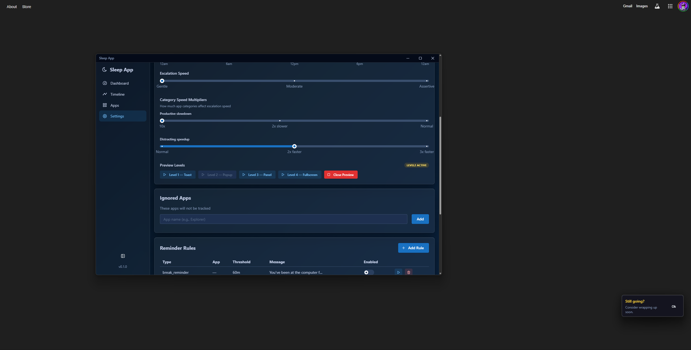
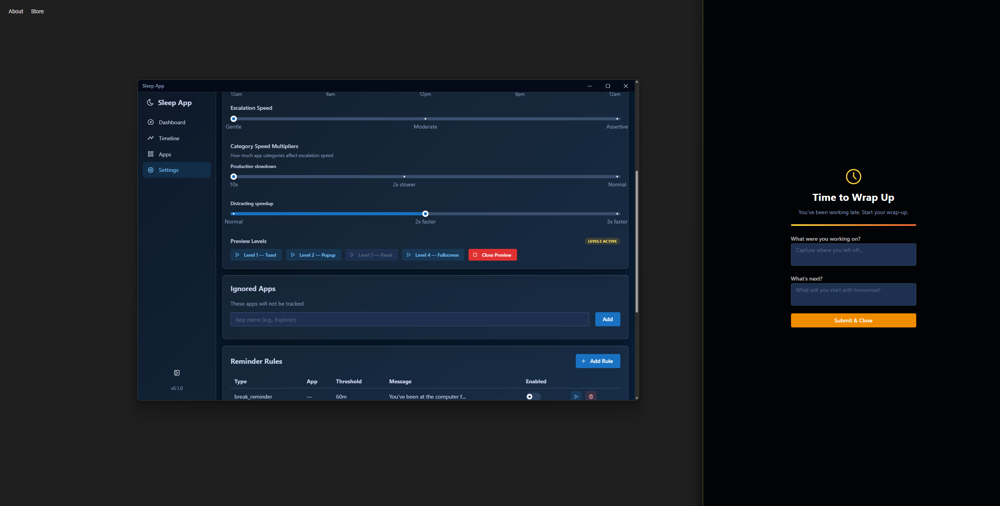
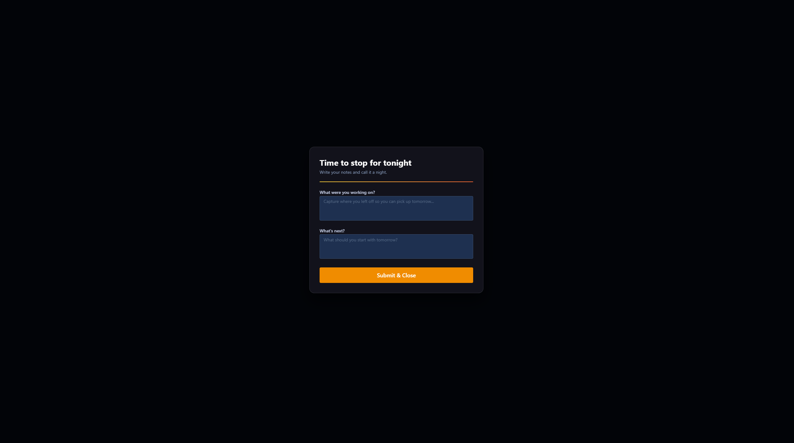

# LucidShift

A desktop productivity and screen-time tracker built with [Tauri 2](https://tauri.app/) (Rust + React/TypeScript). LucidShift runs quietly in the system tray, logs every active window session to a local SQLite database, and uses a time-based escalation system to nudge you to wrap up work at night — getting progressively harder to ignore the later you stay on.

**Landing page:** https://sleepappdeployment-production.up.railway.app/

---

## Features

- **Automatic activity tracking** — polls the active window every 5 seconds and records app name, window title, start/end time, and duration
- **App categorization** — classify any app as Productive, Neutral, or Distracting; category affects escalation speed
- **4-level bedtime escalation** — escalates from a toast notification up to a fullscreen wrap-up prompt based on time of day
- **Timeline view** — browse a full session log for any date
- **Dashboard** — live active app display, daily usage summary, and donut chart breakdown
- **Cloud sync** — optionally sync sessions to the LucidShift API via JWT auth
- **Configurable schedules** — drag handles on a 24-hour bar to define green/yellow/red time zones
- **System tray controls** — pause tracking or escalation without opening the main window
- **3 UI themes** — Glass Dark, Glass Light, Solid Minimal

---

## Screenshots

### Dashboard



The main dashboard shows:
- **Currently Active** — the app and window title being tracked right now, with its category badge
- **Today's Summary** — total tracked time and most-used app for the day
- **Escalation Controls** — quickly pause bedtime reminders for 1 hour, 2 hours, or the rest of the night without going into settings
- **App Usage Breakdown** — donut chart of time distribution across all apps tracked today

---

### App Categorization



The Apps page lets you label every detected application as **Productive (P)**, **Neutral (N)**, or **Distracting (D)**. Categories affect how quickly the escalation system advances — productive apps slow it down, distracting apps speed it up. Apps are grouped by their current category and show when they were last active.

---

### Timeline



A chronological session log filterable by date. Each row shows the app name, the exact window title that was focused, and the precise start time, end time, and duration of that session. Columns are sortable. Useful for reviewing exactly how time was spent during a specific day.

---

### Settings — Appearance & Escalation Schedule



The settings page covers:
- **Appearance** — switch between Glass Dark, Glass Light, and Solid Minimal themes
- **Escalation Schedule** — a draggable 24-hour timeline bar where you set the boundaries of the green zone (safe hours, no escalation), yellow zone (normal escalation speed), and red zone (2× escalation speed). A sensitivity slider controls how many minutes pass between each escalation level.

---

### Settings — Speed Multipliers, Ignored Apps & Reminder Rules



Further down the settings page:
- **Category Speed Multipliers** — tune how much productive or distracting app usage shifts the escalation pace
- **Preview Levels** — fire any escalation level on demand to see what it looks like without waiting for the real trigger
- **Ignored Apps** — add app names that should never be tracked (e.g., system utilities)
- **Reminder Rules** — configure custom time-based or app-limit notifications

The bottom-right corner shows a **Level 2 escalation popup** — a small always-on-top glass card that appears when you've stayed up past your yellow zone threshold.

---

### Level 3 — Side Panel Overlay



When escalation reaches Level 3, a spring-animated panel slides in from the right edge of the screen (roughly 30% screen width). It prompts you to start your wrap-up and provides quick-access fields to capture what you were working on and what's next for tomorrow, without forcing you to stop immediately.

---

### Level 4 — Fullscreen Wrap-Up



The final escalation level covers the entire screen with a focused wrap-up form. It asks two questions — **"What were you working on?"** and **"What's next?"** — so you leave the computer with context for the next day. Submitting the form dismisses the escalation and closes all overlay windows. This is the hardest level to ignore by design.

---

## Escalation Levels Summary

| Level | Surface | Trigger |
|---|---|---|
| 1 | Persistent toast notification | First entry into yellow/red zone |
| 2 | Small floating popup (always-on-top, draggable) | After configured gap at Level 1 |
| 3 | Side panel (right edge, spring animation) | After configured gap at Level 2 |
| 4 | Fullscreen wrap-up overlay | After configured gap at Level 3 |

Escalation pauses automatically when the system is idle for 2+ minutes and resumes when you return.

---

## Dev Setup

Requirements: [Rust](https://rustup.rs/), [Node.js](https://nodejs.org/), [Tauri CLI prerequisites](https://tauri.app/start/prerequisites/) for your platform.

```bash
# from sleep-app/
npm install
npm run tauri dev     # full app (Rust backend + Vite frontend on port 1420)
npm run dev           # frontend only (no tracking, no escalation)
npm run tauri build   # production installer
```

The application will start in your system tray. Click to expand.

---

## Stack

| Layer | Technology |
|---|---|
| Desktop shell | Tauri 2 (Rust) |
| Window tracking | `active-win-pos-rs` |
| Idle detection | `user-idle` |
| Local storage | SQLite via `rusqlite` |
| HTTP sync | `reqwest` with JWT bearer auth |
| Frontend | React 18 + TypeScript + Mantine v8 |
| Animations | framer-motion |
| Charts | Mantine Charts (Recharts) |
| Build tool | Vite 5 |
